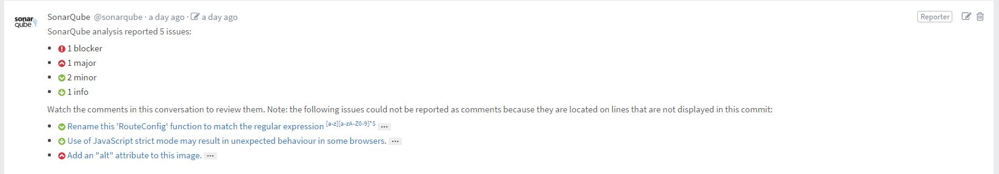
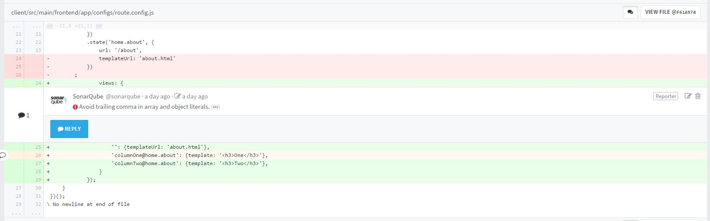

Sonar GitLab Plugin
===================

[](https://gitlab.synaptix-labs.com/ci/projects/12?ref=master)

Fork to https://github.com/SonarCommunity/sonar-github

# Goal

Add to each **commit** GitLab in a global commentary on the new anomalies added by this **commit** and add comment lines of modified files.

Comment commits:


Comment line:


Add build line:


# Usage

For add plugin in SonarQube :

- Download last version http://nexus.synaptix-labs.com/service/local/repo_groups/public_release/content/com/synaptix/sonar-gitlab-plugin/1.4.0/sonar-gitlab-plugin-1.4.0.jar
- Copy file in extensions directory `SONARQUBE_HOME/extensions/plugins`
- Restart SonarQube 

# Command line

Example :

``` shell
mvn --batch-mode verify sonar:sonar -Dsonar.host.url=$SONAR_URL -Dsonar.analysis.mode=preview -Dsonar.issuesReport.console.enable=true -Dsonar.gitlab.commit_sha=$CI_BUILD_REF -Dsonar.gitlab.ref=CI_BUILD_REF_NAME
```

| Variable | Comment | Type |
| -------- | ----------- | ---- |
| sonar.gitlab.url | GitLab url | Administration, Variable |
| sonar.gitlab.max_global_issues | Maximum number of anomalies to be displayed in the global comment |  Administration, Variable |
| sonar.gitlab.user_token | Token of the user who can make reports on the project, either global or per project |  Administration, Project, Variable |
| sonar.gitlab.project_id | Project ID in GitLab or internal id or namespace + name or namespace + path or url http or ssh url or url or web | Project, Variable |
| sonar.gitlab.commit_sha | SHA of the commit comment | Variable |
| sonar.gitlab.ref_name | Branch name or reference of the commit | Variable |

- Administration : **Settings** globals in SonarQube
- Project : **Settings** of project in SonarQube
- Variable : In an environment variable or in the `pom.xml` either from the command line with` -D`